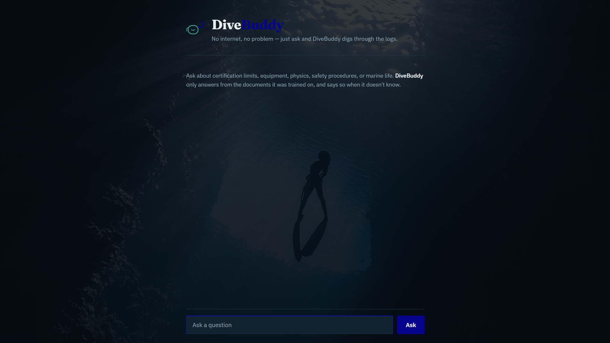

# DiveBuddy — A Local RAG Assistant Built with Microsoft Foundry Local

**Independent Summer Project | Summer 2026**

---

## 1. Project Overview

DiveBuddy is an offline Q&A assistant for scuba diving theory, built with Microsoft Foundry Local and the Retrieval-Augmented Generation (RAG) pattern. It answers questions about certification requirements, equipment, physics, safety procedures, and marine life using only its own document collection, with no internet connection required at inference time.

Built as part of a summer training program based on Microsoft's [Building Your First Local RAG Application with Foundry Local](https://techcommunity.microsoft.com/blog/azuredevcommunityblog/building-your-first-local-rag-application-with-foundry-local/4501968).



---

## 2. How It Works

1. **Ingestion** — A collection of `.txt` documents (diving certification notes and a marine biology handbook) is split into paragraph-level chunks and converted into embedding vectors using Foundry Local's `qwen3-embedding-0.6b` model. Chunks and their vectors are stored in a local SQLite database.
2. **Retrieval** — When a question comes in, it is embedded with the same model and compared against every stored chunk using cosine similarity. The most relevant chunk is selected.
3. **Generation** — If the best match scores above a similarity threshold, the retrieved chunk is passed as context to Foundry Local's `phi-3.5-mini` chat model, along with a system prompt instructing it to answer only from that context. If no chunk scores high enough, DiveBuddy says it doesn't know rather than guessing.

```
   User question
        |
        v
  [ Embed query ] --(qwen3-embedding-0.6b)
        |
        v
  [ Cosine similarity search over SQLite ]
        |
        v
  [ Best chunk above threshold? ] --no--> "I don't know"
        |
       yes
        v
  [ Chat model answers using retrieved context ] --(phi-3.5-mini)
        |
        v
     Answer + source
```

---

## 3. Project Structure

```
local-rag-diving-assistant/
├── belgeler/              Source documents (.txt), one topic per file
├── docs/
│   └── screenshot.png     Screenshot used in this README
├── static/
│   ├── index.html         Browser-based chat interface (DiveBuddy)
│   └── background.jpg     Background photo for the web UI
├── ingest.py              Reads documents, generates embeddings, builds rag.db
├── retrieval.py           Embeds a query and finds the top matching chunks
├── app.py                 Command-line chat interface
├── server.py              Flask backend exposing the same pipeline as a web API
├── main.py                Minimal script to verify the Foundry Local setup
├── chat_test.py           Standalone test of the chat model, independent of RAG
└── rag.db                 Generated by ingest.py (not tracked in git)
```

---

## 4. Setup

**Requirements:** Python 3.10+, [Foundry Local](https://learn.microsoft.com/en-us/azure/foundry-local/what-is-foundry-local) installed and working.

```bash
pip install foundry-local-sdk flask
```

Place `.txt` documents inside a `belgeler/` folder (one topic per file, paragraphs separated by a blank line — each paragraph becomes one retrievable chunk), then build the database:

```bash
python ingest.py
```

---

## 5. Usage

**Command line:**
```bash
python app.py
```

**Web interface:**
```bash
python server.py
```
Then open `http://127.0.0.1:5000` in a browser.

---

## 6. Testing & Evaluation

Manual testing covered five categories: direct-answer questions, indirect/paraphrased questions, in-domain-but-unanswerable questions, fully unrelated questions, and edge cases (empty input, single-word input).

| Category | Example | Result |
|---|---|---|
| Direct answer | "What is the ALFA flag used for?" | ✅ Correct |
| Indirect / paraphrased | "Why do divers wear hoods?" | ⚠️ Initially missed by retrieval, fixed (see §7) |
| In-domain, unanswerable | "What is the best dive site in Antalya?" | ✅ Correctly declined |
| Fully unrelated | "What is the capital of France?" | ✅ Correctly declined |
| Edge case | Empty input / single word | ✅ No crash; single-word queries can produce overly general answers (see §7) |

Retrieval quality was also benchmarked before and after switching the knowledge base from Turkish to English: best-match cosine similarity on a comparable question rose from **0.733 to 0.831**.

### 6.1 Full Test Log

| # | Category | Question | Expected | Result |
|---|---|---|---|---|
| 1 | Direct answer | What is the maximum depth limit for a one-star diver? | 18 meters | ✅ Correct |
| 2 | Direct answer | What is the ALFA flag used for? | "diver below, keep well clear" | ✅ Correct |
| 3 | Direct answer | How many verified dives are required before starting guide diver training? | 50 dives | ✅ Correct |
| 4 | Indirect / paraphrased | Why do divers wear hoods? | Heat loss through the neck (~50%) | ⚠️ Initially missed by retrieval — fixed by splitting the source chunk (see §7) |
| 5 | Indirect / paraphrased | Which sea has no oxygen below 200 meters? | Black Sea, due to H₂S | ✅ Correct |
| 6 | In-domain, unanswerable | What is the best dive site in Antalya? | "I don't know" | ✅ Correctly declined |
| 7 | In-domain, unanswerable | How deep can a whale shark dive? | "I don't know" | ✅ Correctly declined |
| 8 | Fully unrelated | What is the capital of France? | "I don't know" | ✅ Correctly declined |
| 9 | Fully unrelated | How do I bake a chocolate cake? | "I don't know" | ✅ Correctly declined |
| 10 | Edge case | Empty input | No crash | ✅ Handled gracefully |
| 11 | Edge case | Single word: "diving" | "I don't know" or a reasonable chunk | ⚠️ Passed the threshold but produced an overly general answer not grounded in the retrieved chunk — noted as a limitation (see §7) |

**Result: 9 of 11 test cases passed outright; the 2 exceptions were investigated, and one (#4) was fixed during testing.**

---

## 7. Design Decisions & Limitations

- **English over Turkish:** The knowledge base and prompts were switched from Turkish to English after testing showed the local chat model (`phi-3.5-mini`) produced noticeably lower-quality answers on Turkish text, and retrieval scores were also lower.
- **Similarity threshold (0.55):** Chosen empirically — answerable questions consistently scored above ~0.60, while unanswerable or unrelated questions scored ~0.40–0.50. This threshold is what lets DiveBuddy say "I don't know" instead of fabricating an answer.
- **Chunk granularity matters:** A chunk mixing several sub-topics in one paragraph caused a relevant fact to be missed by retrieval entirely, because the embedding averaged over unrelated sentences diluted the specific detail. Splitting the paragraph into two smaller, single-idea chunks raised its retrieval rank from outside the top 5 to rank 1 (score 0.751). Not all documents have been audited for this issue — it's a known area for further improvement.
- **top_k=1 for generation:** Only the single best-matching chunk is passed to the chat model to keep answers focused. This occasionally causes short or ambiguous queries to retrieve a technically-above-threshold but loosely related chunk. Increasing top_k with stricter prompt instructions is a possible future improvement.
- **CPU inference speed:** Since everything runs locally without a GPU, chat responses take a few seconds rather than being instant — the expected trade-off for offline, zero-cost inference.
- **rag.db is not versioned:** It's fully reproducible by running `ingest.py`, so it's excluded via `.gitignore`.

---

## 8. How to Reproduce

1. Clone the repository:
```bash
git clone https://github.com/tuna-kemer/local-rag-diving-assistant.git
cd local-rag-diving-assistant
```

2. Install dependencies:
```bash
pip install foundry-local-sdk flask
```

3. Build the database:
```bash
python ingest.py
```

4. Run the CLI or the web app:
```bash
python app.py
# or
python server.py
```

---

## 9. Dependencies

```
foundry-local-sdk
flask
```

---

## 10. AI Usage Disclosure

AI assistance (Claude by Anthropic) was used throughout this project as a project mentor and coding assistant. Specifically, Claude was used for:
- Explaining RAG, embeddings, and Foundry Local concepts
- Debugging Python code and resolving library/environment errors
- Translating the knowledge base and drafting the web interface
- Reviewing and structuring this README

All testing, evaluation decisions, and conclusions are the author's own work.

---

## 11. Data Sources

The knowledge base was built from two original document sets, translated into English and chunked for retrieval:

- **One-star diver certification training notes** — administrative rules, basic equipment, pressure/volume physics, physiology, buoyancy equipment, rescue procedures, and safe diving rules.
- **TSSF (Turkish Underwater Sports Federation) Guide Diver Handbook** (*TSSF Rehber Dalıcı El Kitabı*) — a 91-page reference manual, from which sections on guide diver requirements, marine environments, biological oceanography, the seas of Turkey, and protected/invasive species were condensed and translated for this project's knowledge base.

---

## Notes

This project was completed independently by a Sabancı University Computer Science student, following a self-directed one-month curriculum based on Microsoft's local RAG tutorial and Foundry Local documentation.
